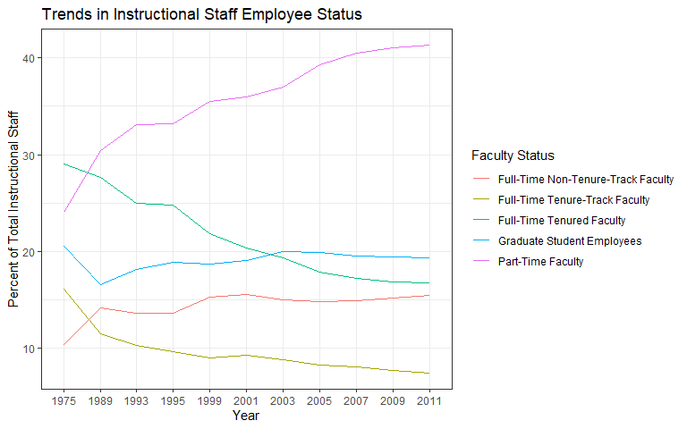
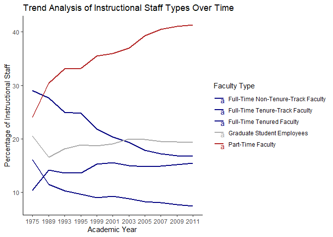
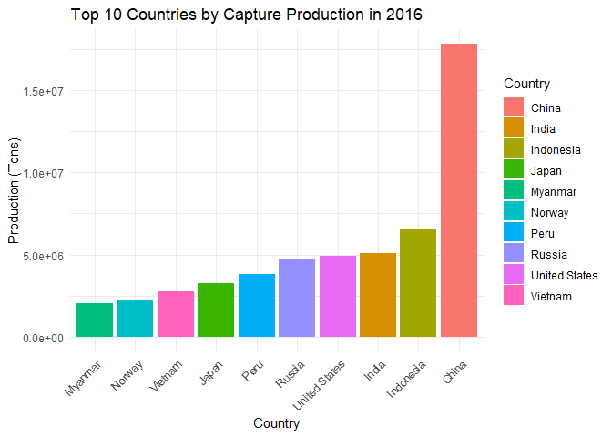
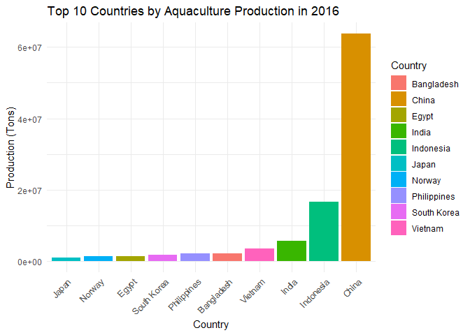
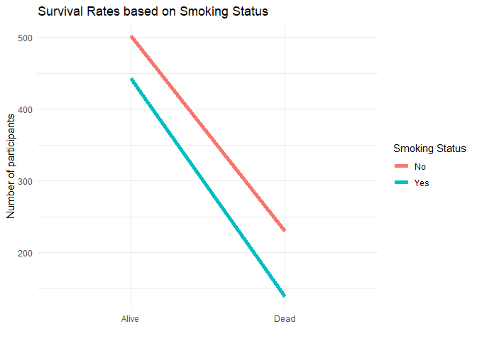
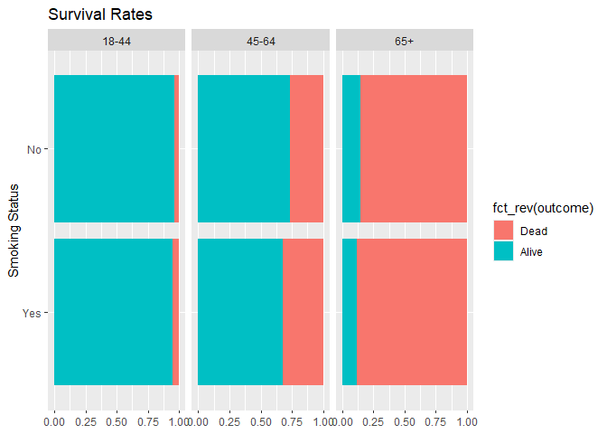

Lab 06 - Ugly charts and Simpson’s paradox
================
Jamieson Nathan
01/21/25

### Load packages and data

``` r
library(tidyverse) 
library(dsbox)
library(mosaicData) 
library(ggplot2)

staff <- read_csv("data/instructional-staff.csv")
```

### 1. Include the line plot you made above in your report and make sure the figure width is large enough to make it legible (also fix the title, axis labels, and legend label)

``` r
staff_long <- staff %>%
  pivot_longer(cols = -faculty_type, names_to = "year") %>%
  mutate(value = as.numeric(value))

staff_long
```

    ## # A tibble: 55 × 3
    ##    faculty_type              year  value
    ##    <chr>                     <chr> <dbl>
    ##  1 Full-Time Tenured Faculty 1975   29  
    ##  2 Full-Time Tenured Faculty 1989   27.6
    ##  3 Full-Time Tenured Faculty 1993   25  
    ##  4 Full-Time Tenured Faculty 1995   24.8
    ##  5 Full-Time Tenured Faculty 1999   21.8
    ##  6 Full-Time Tenured Faculty 2001   20.3
    ##  7 Full-Time Tenured Faculty 2003   19.3
    ##  8 Full-Time Tenured Faculty 2005   17.8
    ##  9 Full-Time Tenured Faculty 2007   17.2
    ## 10 Full-Time Tenured Faculty 2009   16.8
    ## # ℹ 45 more rows

``` r
staff_long %>%
  ggplot(aes(
    x = year,
    y = value,
    group = faculty_type,
    color = faculty_type
  )) +
  geom_line()+
  theme_bw()+
  labs(
    x = "Year",
    y = "Percent of Total Instructional Staff",
    title = "Trends in Instructional Staff Employee Status",
    color = "Faculty Status"
  )
```

<!-- -->

### 2. Suppose the objective of this plot was to show that the proportion of part-time faculty have gone up over time compared to other instructional staff types.

``` r
staff_long <- staff %>%
  pivot_longer(cols = -faculty_type, names_to = "year", values_to = "value") %>%
  mutate(
    value = as.numeric(value)
  )

staff_long %>%
  ggplot(aes(
    x = year,
    y = value,
    group = faculty_type,
    color = faculty_type  
  )) +
  geom_line(size = 1) +  
  scale_color_manual(  
    values = c(
      "Part-Time Faculty" = "firebrick",
      "Full-Time Tenured Faculty" = "navy",
      "Full-Time Tenure-Track Faculty" = "navy",
      "Full-Time Non-Tenure-Track Faculty" = "navy",
      "Graduate Student Employees" = "darkgrey"
    )
  ) +
  theme_classic() +  
  labs(
    title = "Trend Analysis of Instructional Staff Types Over Time",
    x = "Academic Year",
    y = "Percentage of Instructional Staff",
    color = "Faculty Type"  
  ) +
  geom_text(aes(label = ifelse(year == "2019", faculty_type, NA)), hjust = 1.1, vjust = 0) 
```

    ## Warning: Using `size` aesthetic for lines was deprecated in ggplot2 3.4.0.
    ## ℹ Please use `linewidth` instead.
    ## This warning is displayed once every 8 hours.
    ## Call `lifecycle::last_lifecycle_warnings()` to see where this warning was
    ## generated.

    ## Warning: Removed 55 rows containing missing values or values outside the scale range
    ## (`geom_text()`).

<!-- -->

I adjusted the graph to improve clarity and interpretation. By linking
colors to faculty types and using a legend, it’s easier to differentiate
the data. Custom colors emphasize trends, particularly the increase in
part-time faculty. Labels on the latest data point highlight recent
trends without cluttering the graph, ensuring the visualization is
informative and visually appealing.

### 3. Fisheries

These visuals are very confusing and not super informative…

``` r
library(ggplot2)
library(readr)
library(dplyr)  

fisheries <- read_csv("data/fisheries.csv")
```

    ## Rows: 216 Columns: 4
    ## ── Column specification ────────────────────────────────────────────────────────
    ## Delimiter: ","
    ## chr (1): country
    ## dbl (3): capture, aquaculture, total
    ## 
    ## ℹ Use `spec()` to retrieve the full column specification for this data.
    ## ℹ Specify the column types or set `show_col_types = FALSE` to quiet this message.

``` r
str(fisheries)
```

    ## spc_tbl_ [216 × 4] (S3: spec_tbl_df/tbl_df/tbl/data.frame)
    ##  $ country    : chr [1:216] "Afghanistan" "Albania" "Algeria" "American Samoa" ...
    ##  $ capture    : num [1:216] 1000 7886 95000 3047 0 ...
    ##  $ aquaculture: num [1:216] 1200 950 1361 20 0 ...
    ##  $ total      : num [1:216] 2200 8836 96361 3067 0 ...
    ##  - attr(*, "spec")=
    ##   .. cols(
    ##   ..   country = col_character(),
    ##   ..   capture = col_double(),
    ##   ..   aquaculture = col_double(),
    ##   ..   total = col_double()
    ##   .. )
    ##  - attr(*, "problems")=<externalptr>

``` r
head(fisheries)
```

    ## # A tibble: 6 × 4
    ##   country        capture aquaculture  total
    ##   <chr>            <dbl>       <dbl>  <dbl>
    ## 1 Afghanistan       1000        1200   2200
    ## 2 Albania           7886         950   8836
    ## 3 Algeria          95000        1361  96361
    ## 4 American Samoa    3047          20   3067
    ## 5 Andorra              0           0      0
    ## 6 Angola          486490         655 487145

``` r
top_capture <- fisheries %>%
  arrange(desc(capture)) %>%
  slice(1:10)

top_aquaculture <- fisheries %>%
  arrange(desc(aquaculture)) %>%
  slice(1:10)
```

``` r
ggplot(top_capture, aes(x = reorder(country, capture), y = capture, fill = country)) +
  geom_bar(stat = "identity") +
  labs(
    title = "Top 10 Countries by Capture Production in 2016",
    x = "Country",
    y = "Production (Tons)",
    fill = "Country"
  ) +
  theme_minimal() +
  theme(axis.text.x = element_text(angle = 45, hjust = 1))  
```

<!-- -->

``` r
ggplot(top_aquaculture, aes(x = reorder(country, aquaculture), y = aquaculture, fill = country)) +
  geom_bar(stat = "identity") +
  labs(
    title = "Top 10 Countries by Aquaculture Production in 2016",
    x = "Country",
    y = "Production (Tons)",
    fill = "Country"
  ) +
  theme_minimal() +
  theme(axis.text.x = element_text(angle = 45, hjust = 1))  
```

<!-- -->

# Smokers in Whickham

### What type of study do you think these data come from: observational or experiment? Why?

### How many observations are in this dataset? What does each observation represent?

### How many variables are in this dataset? What type of variable is each? Display each variable using an appropriate visualization.

### What would you expect the relationship between smoking status and health outcome to be?

``` r
library(tidyverse)

data(Whickham)

?Whickham
```

    ## starting httpd help server ... done

Likely observational, as it would be pretty unethical to have an
experimental control forcing people to smoke…

There are 1314 observation refering to different female participants in
the study. There are 3 variables including outcome (survival sttus after
20 years; alive/dead), smoking status at baseline (yes/no), and age (in
years at onset).

Just based on common-sense, it would be likely that smokers at baseline
die more than their counterparts at the 20-year follow-up. Although
depending on age of initial testing this may not be as clear (i.e.,
40-year old smokers are probably still doing okay as opposed to 60+).

### Create a visualization depicting the relationship between smoking status and health outcome. Briefly describe the relationship, and evaluate whether this meets your expectations. Additionally, calculate the relevant conditional probabilities to help your narrative.

``` r
Whickham %>%
  count(smoker, outcome)
```

    ##   smoker outcome   n
    ## 1     No   Alive 502
    ## 2     No    Dead 230
    ## 3    Yes   Alive 443
    ## 4    Yes    Dead 139

``` r
Whickham %>%
  count(smoker, outcome) %>%
  ggplot(aes(x = outcome, y = n, group = smoker, color = smoker)) +
  geom_line(linewidth = 2) +
  labs(
    title = "Survival Rates based on Smoking Status",
    x = "",
    y = "Number of participants",
    color = "Smoking Status"
  ) +
  theme_minimal()
```

<!-- -->

``` r
Whickham %>%
  count(smoker, outcome) %>%
  group_by(smoker) %>%
  mutate(cond_prob = n /sum(n))
```

    ## # A tibble: 4 × 4
    ## # Groups:   smoker [2]
    ##   smoker outcome     n cond_prob
    ##   <fct>  <fct>   <int>     <dbl>
    ## 1 No     Alive     502     0.686
    ## 2 No     Dead      230     0.314
    ## 3 Yes    Alive     443     0.761
    ## 4 Yes    Dead      139     0.239

Contrary to expectations, these lines seem somewhat unrelated, and the
conditional probability supports this. There does not seem to be much of
a relationship between smoking status and survival rates at a 20-year
followup. Perhaps Big Tobacco was right and cig’s are good for you… Or
we need a longer follow-up.

### Re-create the visualization depicting the relationship between smoking status and health outcome, faceted by age_cat. What changed? What might explain this change? Extend the contingency table from earlier by breaking it down by age category and use it to help your narrative. We can use the contingency table to examine how the relationship between smoking status and health outcome differs between different age groups. This extension will help us better understand the patterns we see in the visualization, and explain any changes we observe.

``` r
Whickham_ages <- Whickham %>%
 mutate(age_cat = case_when(
    age <= "44" ~ "18-44",
    age > "44" & age <= "64" ~ "45-64",
    age > "64" ~ "65+",
      ))

Whickham_ages %>%
 ggplot(aes(
   y = fct_rev(smoker), 
   fill = fct_rev(outcome))) +
  geom_bar(position = "fill") + 
   facet_wrap(~age_cat)+
  labs(title = "Survival Rates",
     y = "Smoking Status", x = NULL)
```

<!-- -->

``` r
Whickham_ages %>%
  count(smoker, age_cat, outcome) %>%
  group_by(smoker, age_cat) %>%
  mutate(cond_prob = n /sum(n))
```

    ## # A tibble: 12 × 5
    ## # Groups:   smoker, age_cat [6]
    ##    smoker age_cat outcome     n cond_prob
    ##    <fct>  <chr>   <fct>   <int>     <dbl>
    ##  1 No     18-44   Alive     327    0.965 
    ##  2 No     18-44   Dead       12    0.0354
    ##  3 No     45-64   Alive     147    0.735 
    ##  4 No     45-64   Dead       53    0.265 
    ##  5 No     65+     Alive      28    0.145 
    ##  6 No     65+     Dead      165    0.855 
    ##  7 Yes    18-44   Alive     270    0.947 
    ##  8 Yes    18-44   Dead       15    0.0526
    ##  9 Yes    45-64   Alive     167    0.676 
    ## 10 Yes    45-64   Dead       80    0.324 
    ## 11 Yes    65+     Alive       6    0.12  
    ## 12 Yes    65+     Dead       44    0.88

The plot and table show a more nuanced relationship than before, with
older adults being less likely to survive at follow-up. However, the
differences do seem small, maybe a line plot would have made more sense
than a bar chart… All-in-all what I am taking away is that smoking is
good for you, thanks Mason!
